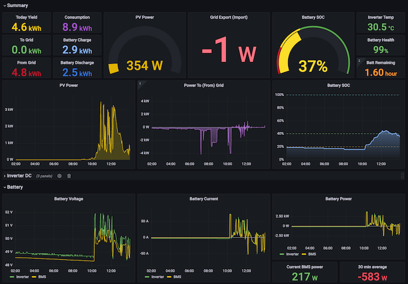

# solis_exporter

This program connects to the RS485 (modbus) link between a Solis Hybrid
inverter and its Wifi stick data logger.

It passively sniffs the messages between the data logger and the inverter,
and turns these into Prometheus metrics.

Optionally, it can also be used to *inject* modbus messages, acting as a
modbus TCP gateway which can be used to read and alter its configuration.

Tested with Solis inverter RHI-6K-48ES-5G, which reports model number 3105,
in the United Kingdom.

**USE AT YOUR OWN RISK!**

Tapping onto to the RS485 link requires opening and modifying the wifi
data logger itself.

Whilst passive sniffing should be safe, do not enable the TCP gateway
unless you have fully understood the consequences!
