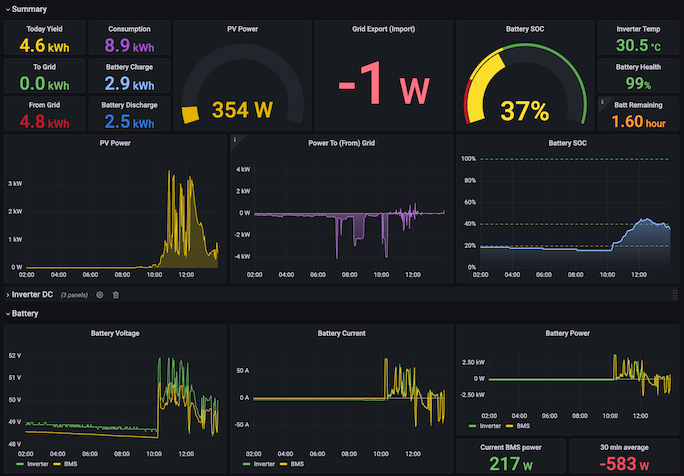

# Configuration

## Exporter

The exporter is configured using a YAML file `solis_exporter.yml`. The
location of the config file is given using the `-config` flag, e.g.

```
./solis_exporter -config /etc/solis_exporter.yml
```

The configuration file has only a few required settings:

```
serial:
  device: /dev/ttyUSB0
  #dump: true

solis_exporter:
  listen: ':3105'
```

"dump" shows all the packet exchanges on RS485 in raw hex.

You can run the exporter under systemd, using the sample service file.  You
may need to tweak this: e.g.  to change the user that the daemon runs as. 
This user must have permission to open the serial device.

```
sudo cp solis_exporter.service /etc/systemd/system/
sudo systemctl daemon-reload
sudo systemctl enable --now solis_exporter
```

### Reading metrics

[Metrics](../metrics/) are available on the given port under `/metrics`. 
You can read them using:

```
curl 127.0.0.1:3105/metrics
```

Most metrics will not appear until the first successfully sniffed packet
exchanges.

You can then configure prometheus with a scrape job to read metrics
periodically from the exporter:

```
  - job_name: solis
    static_configs:
      - targets:
          - x.x.x.x:3105
```

### Dashboard

Grafana dashboard [17503](https://grafana.com/grafana/dashboards/17503)
provides a basic set of graphs from data stored in prometheus.



## Modbus TCP gateway

The optional modbus TCP gateway facility allows you to inject messages onto
the RS485 bus, to query or change the inverter settings.

To enable this feature, add a stanza to solis_exporter.yml like this:

```
gateway:
  listen: '127.0.0.1:1502'
  rules:
    - from: 10001
      to: 19999
      functions: [2]
    - from: 30001
      to: 39999
      functions: [3,4]
    - from: 40001
      to: 49999
      functions: [3]
```

!!! warning
    The modbus TCP protocol is completely unauthenticated.  Unless you bind
    to 127.0.0.1 as shown, then connections will be accepted from anyone
    on the network, and they will be able to mess with your inverter.

    You could use firewall rules to limit the client addresses which can
    connect to this port.

### Port

If you prefer to listen on the standard modbus TCP port 502, you will need
to give the program permission to bind to privileged ports.  This can be
done by running the exporter as root, or you can give it the
`NET_BIND_SERVICE` capability.  If running as a service under systemd, you
can use these settings:

```
[Service]
...
CapabilityBoundingSet=CAP_NET_BIND_SERVICE
AmbientCapabilities=CAP_NET_BIND_SERVICE
```

### Rules

The gateway "rules" allow you to limit which function codes and register
ranges are accepted in TCP modbus requests.  Only register ranges and codes
which match a rule are permitted.  I recommend you limit access to function
codes 6 (write single) and 16 (write multiple) to small ranges of registers
that you are sure are safe to update.  Note that no validation of the
*values* written to those registers is performed, only the register ranges.

### Usage

You can connect to the gateway with any client which speaks the simple
modbus TCP protocol.  Only a limited set of modbus commands are currently
implemented; if you send any messages which are not understood, the TCP
connection will be dropped.

You need to use a high response timeout of around 10 seconds.  This is
because if you try to inject a message at the same time as the data logger
is communicating with the inverter, solis_exporter will wait until the line
is idle.

!!! warning
    As explained before: if this is running in tandem with a Solis data
    logger, then you have two masters on the bus and they risk stomping on
    each other's messages.  You should aim to minimize the number of
    messages you inject this way.

    In particular, I recommend that you *don't* regularly poll the inverter.
    Read the metrics from solis_exporter using HTTP instead; these can be
    read as often as you like, and reflect the most recently seen state.

    solis_exporter avoids sending until the line has been idle for at least
    1.5 seconds, but it has no way of knowing when the data logger will next
    decide to send a message.
