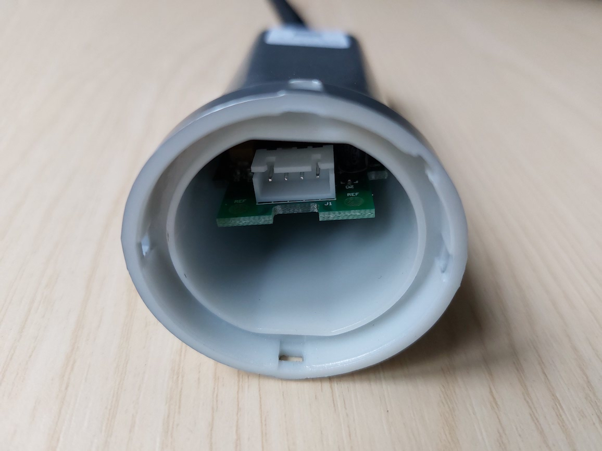
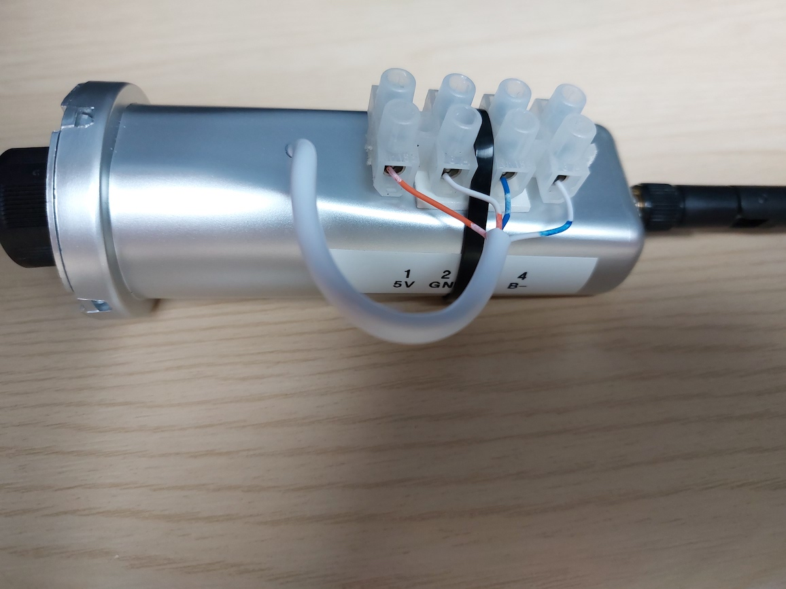

# Hardware requirements

## RS485 interface

I bought a [Waveshare isolated USB to RS485
adapter](https://www.amazon.co.uk/gp/product/B07P3JGGLG/).  This is based on
the FT232RL chipset which automatically handles the turning on and off of
the transmit driver, so there's nothing in the code here to do this.  There
are cheaper RS485 adapters available, but the isolation makes me feel more
comfortable about electrical safety.

The device appears by default as `/dev/ttyUSB0` if you have no other
serial-USB adapters, although I recommend you refer to it using one of the
links under `/dev/serial/by-id/` or `/dev/serial/by-path/` because this
avoids problems when you have multiple USB devices, which may choose an
arbitrary ordering at bootup.

## Data logger connection

!!! warning
    Modifying the data logger is not for the faint hearted!

    You will almost certainly void the warranty on your
    logger, and possibly the complete system.  Do not proceed
    unless you are 100% confident that you can do this safely.

    Consider [the alternative approaches](../alternatives/) first.

Disconnect the logger from the inverter.

Prising open the logger is easy: push two small screwdrivers into two
adjacent opening points.

 

The circuit board can be removed by unscrewing the wifi antenna, removing
the nut and washer on the antenna connector, and then pulling the board out.

I soldered on four extra connections in parallel with the existing
connector:

Then I drilled a hole in the side of the logger case and brought the
connections out to a terminal block for flexibility, using the numbering
from the Exceed connector pins:

1. 5V (red)
2. Ground (black)
3. A+ (yellow)
4. B- (blue)

In future I might use something like as Raspberry Pi Zero W, and it could be
powered from the 5V line.  Otherwise, make sure you don't connect anything
to 5V.

The wifi data logger doesn't appear to have a 120 ohm terminating resistor,
so I added one at the USB-RS485 end.
